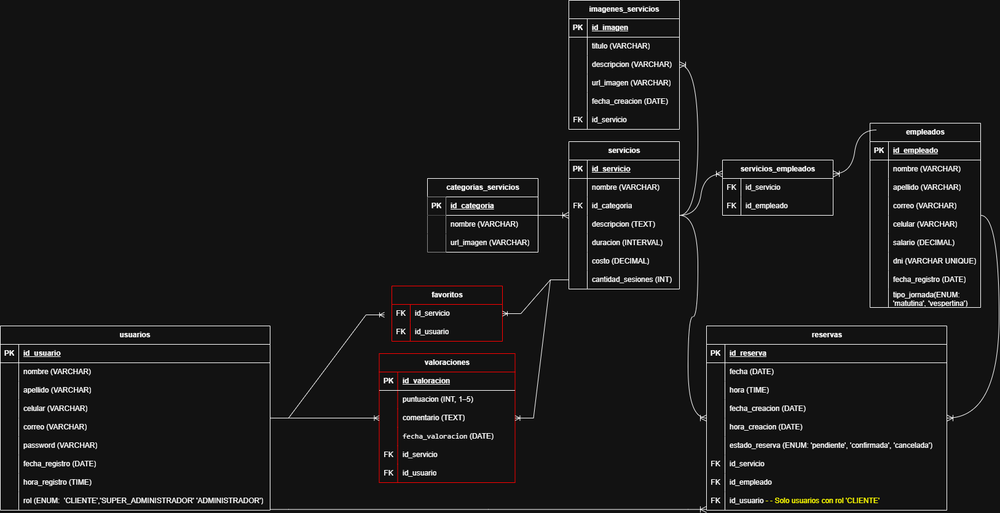

# 📂 Base de Datos - Booking Salón de Belleza 💇‍♀️💅

## 1️⃣ 📊 **Diagrama Entidad-Relación (ERD)**
📌 **Diagrama:**

---

## 2️⃣ 🔁 **Restricciones y Reglas de Integridad**

En el diseño de la base de datos, aplicamos **restricciones de cascada** (`ON DELETE CASCADE`, `ON DELETE SET NULL`, `ON DELETE RESTRICT`) para **garantizar la integridad de los datos** y definir qué sucede cuando se eliminan registros.

### 🚀 **Reglas de Eliminación (`ON DELETE`)**

| Relación | Regla Aplicada | Explicación |
|----------|--------------|-------------|
| **Cliente → Reservas** | `ON DELETE CASCADE` | Si un cliente se elimina, **todas sus reservas se eliminan automáticamente**. Esto evita reservas huérfanas. |
| **Empleado → Reservas** | `ON DELETE SET NULL` | Si un empleado se elimina, **la reserva sigue existiendo pero sin empleado asignado (`NULL`)**, permitiendo reasignación manual. |
| **Servicio → Reservas** | `ON DELETE RESTRICT` | **No se permite eliminar un servicio si hay reservas activas**. Primero se deben cancelar o reasignar. |
| **Categoría de Servicio → Servicios** | `ON DELETE RESTRICT` | **No se puede eliminar una categoría si aún tiene servicios registrados**. |
| **Servicio → Empleados** (Tabla pivote) | `ON DELETE CASCADE` | Si un servicio se elimina, **la relación con empleados también se borra**. |
| **Empleado → Servicios** (Tabla pivote) | `ON DELETE CASCADE` | Si un empleado se elimina, **su relación con los servicios desaparece**. |

---

### 🔄 **Reglas de Actualización (`ON UPDATE`)**

| Relación | Regla Aplicada | Explicación |
|----------|--------------|-------------|
| **Cliente → Reservas** | `ON UPDATE CASCADE` | Si el `id_cliente` cambia, **se actualiza en todas sus reservas automáticamente**. |
| **Empleado → Reservas** | `ON UPDATE CASCADE` | Si el `id_empleado` cambia, **se actualiza en las reservas donde esté asignado**. |
| **Servicio → Reservas** | `ON UPDATE CASCADE` | Si el `id_servicio` cambia, **se refleja en las reservas sin perder la relación**. |

---

## 3️⃣ ⚡ **Reglas y Validaciones Adicionales**

✅ **Estados de Reservas (`ENUM`)**  
Las reservas pueden tener estos estados:
- `pendiente`
- `confirmada`
- `cancelada`

Esto asegura que solo valores válidos puedan ser almacenados.

✅ **Horarios de Reservas**  
Se restringen las reservas a un horario de **9:00 AM a 9:00 PM**, evitando registros fuera del horario laboral.

✅ **Duración de Servicios**  
Cada servicio tiene una duración establecida en **horas**, evitando conflictos de agenda.

✅ **Salario de Empleados**  
Se define un **mínimo y máximo** permitido para evitar valores incorrectos.

---

### 🎯 **Resumen para el Backend**
1️⃣ **Eliminar un cliente → Borra todas sus reservas (`CASCADE`)**  
2️⃣ **Eliminar un empleado → Reserva sigue, pero sin empleado (`SET NULL`)**  
3️⃣ **Eliminar un servicio → No se puede si tiene reservas (`RESTRICT`)**  
4️⃣ **Eliminar una categoría → No se puede si hay servicios (`RESTRICT`)**  
5️⃣ **Actualizar claves → Se actualizan en todas las relaciones (`CASCADE`)**

---